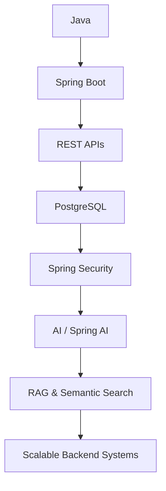

 

**Building scalable backend systems and AI-powered applications.**

`Java` · `Spring Boot` · `PostgreSQL` · `pgvector` · `RAG` · `System Design`

 

## About Me

I build backend systems and AI-powered applications with Java and Spring Boot, focused on retrieval-augmented generation and semantic search over PostgreSQL and pgvector. My work centers on REST API design, secure authentication with Spring Security, and designing systems that scale in production. Currently going deeper into distributed systems and performance optimization.

 

## 🧰 Tech Stack

**Languages**

  

**Backend**

   

**Database**

   

**AI**

   

**Cloud & DevOps**

 

 

## ⚙️ Engineering Focus

 

## 📊 GitHub Activity

  

  

  

 

## 🚀 Featured Projects

<table>
<tr>
<td width="50%" valign="top">

### 🔍 Semantic Search Platform

Enterprise semantic search engine built with Spring Boot, Python, PostgreSQL, and pgvector.

**Tech Stack**

    

**Highlights**
- Vector similarity search powered by pgvector
- REST API architecture
- PostgreSQL-backed indexing
- Python service integration

</td>
<td width="50%" valign="top">

### 💼 Job Application Tracker API

Secure backend system for managing job applications using JWT authentication and PostgreSQL.

**Tech Stack**

    

**Highlights**
- JWT-based authentication
- Spring Security access control
- PostgreSQL persistence
- Containerized with Docker

</td>
</tr>
<tr>
<td width="50%" valign="top">

### ☁️ SaaS Expense Tracker

Cloud-native expense management application with authentication and reporting.

**Tech Stack**

   

**Highlights**
- Cloud-native deployment on AWS
- MySQL-backed data layer
- Authenticated multi-user access
- Expense reporting workflows

</td>
<td width="50%" valign="top">

### 📚 Online Book Store

Complete backend for an e-commerce bookstore with authentication and order management.

**Tech Stack**

   

**Highlights**
- RESTful API design
- JPA-based data persistence
- Order management workflows
- User authentication

</td>
</tr>
</table>

 

## 🚧 Currently Building

 

 

 

## 🤝 Connect

